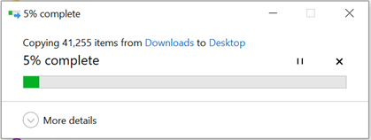
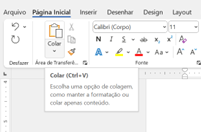
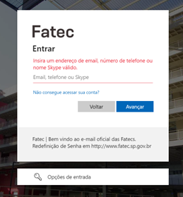

<h1 align="center">Aplicação da Inteligência Artificial em uma área especifica</h1>
<a href="../IHC/Inteligência Artificial para deficientes auditivos.pdf">Artigo - Inteligência Artificial para deficientes auditivos</a>

  

<h1 align="center">10 Heurísticas de Usabilidade para User Interface</h1>

<h3 id="1.visibilidade-do-status-do-sistema">1. Visibilidade do status do sistema</h2>
O sistema deve informar o que está acontecendo em tempo real para o usuário.

  
   Figura 1: Exemplo de visibilidade do status do sistema.
   <b>O sistema permite visualizar qual o status atual</b>

 

  
   Figura 2: Exemplo negativo de visibilidade do status do sistema.
   <b>O sistema mostra apenas que a página está carregando</b>

 

<h3 id="2.correspondência-entre-o-sistema-e-o-mundo-real">2. Correspondência entre o sistema e o mundo real</h2>
O sistema deve ter a mesma linguagem que seu usuário utiliza no dia a dia, conceitos que sejam familiares.

  
   Figura 3: Exemplo de correspondência entre o sistema e o mundo real.
   <b>Familiaridade com objetos do mundo real</b>

 

  
   Figura 4: Exemplo negativo de correspondência entre o sistema e o mundo real.
   <b>Linguagem excessivamente técnica</b>

 

<h3 id="3.controle-e-liberdade-do-usuário">3. Controle e liberdade do usuário</h2>
O sistema deve dar ao usuário a liberdade de fazer o que quiser, facilitando a compreensão do conteúdo que irá consumir.

  
   Figura 5: Exemplo de controle e liberdade do usuário.
   <b>O botão 'desfazer' permite cancelar o envio da mensagem</b>

 

<h3 id="4.consistência-e-padrões">4. Consistência e padrões</h2>
A interface deve manter uma consistência, garantir a harmonia visual e induzir o costume para o usuário.

  
   Figura 7: Exemplo de consistência e padrões.
   <b>Interface mantém uma consistência, permitindo que o usuário identifique os padrões de estética</b>

 

  
   Figura 8: Exemplo negativo de consistência e padrões.
   <b>Falta de padronização, muitas cores e imagens sem harmonia</b>

 

<h3 id="5.prevenção-de-erros">5. Prevenção de erros</h2>
O sistema deve buscar prevenir que problemas ocorram, eliminando condições mais propensas ao erro.

  
   Figura 9: Exemplo de prevenção de erros.
   <b>Ajudar os usuários a não cometer erros oferecendo sugestões de pesquisa</b>

 

  
   Figura 10: Exemplo negativo de prevenção de erros.
   <b>Ao clicar no botão de sair não é exibido nenhuma mensagem de confirmação</b>

 

<h3 id="6.reconhecimento-em-vez-de-lembrança">6. Reconhecimento em vez de lembrança</h2>
Aconselha-se minimizar a quantidade de informações que o usuário precisa memorizar, para isso, são utilizados padrões para o reconhecimento.

  
   Figura 11: Exemplo de reconhecimento em vez de lembrança.
   <b>Auxilio ao usuário a relembrar páginas previamente acessadas</b>

 

<h3 id="7.flexibilidade-e-eficiência-de-uso">7. Flexibilidade e eficiência de uso</h2>
A interface deve permitir que os usuários tenham uma boa experiência com o sistema e se adaptem as ações frequentes.

  
   Figura 13: Exemplo de flexibilidade e eficiência de uso.
   <b>Atalhos que permitem realizar tarefas mais rapidamente</b>

 

  
   Figura 14: Exemplo negativo de flexibilidade e eficiência de uso.
   <b>Grande quantidade de cliques para realizar uma ação</b>

 

<h3 id="8.estética-e-design-minimalista">8. Estética e design minimalista</h2>
A interface deve ser minimalista e o conteúdo o mais direto possível, para não cansar o usuário.

  
   Figura 15: Exemplo de estética e design minimalista.
   <b>Interface minimalista com conteúdo direto</b>

 

  
   Figura 16: Exemplo negativo de estética e design minimalista.
   <b>Grande quantidade de informações</b>

 

<h3 id="9.ajudar-o-usuário-a-reconhecer,-diagnosticar-e-recuperar-se-de-erros">9. Ajudar o usuário a reconhecer, diagnosticar e recuperar-se de erros</h2>
Em caso de algum erro, mostrar mensagens claras e objetivas e próximas da ação que causou o erro.

  
   Figura 17: Exemplo de ajuda ao usuário reconhecer, diagnosticar e recuperar-se de erros.
   <b>Mensagem de erro clara em linguagem simples</b>

 

  
   Figura 18: Exemplo negativo de ajuda ao usuário reconhecer, diagnosticar e recuperar-se de erros.
   <b>Mensagem de erro com falta de clareza e objetividade</b>

 

<h3 id="10.ajuda-e-documentação">10. Ajuda e documentação</h2>
Preparar uma ferramenta de auxílio ao usuário, de forma mais detalhada, facilitando a usabilidade.

  
   Figura 19: Exemplo de ajuda e documentação.
   <b>Item de auxílio para o usuário</b>

 

  
   Figura 20: Exemplo negativo de ajuda e documentação.
   <b>Ao inserir a senha errada nenhuma mensagem de erro é recebida, falta de auxílio</b>

 
